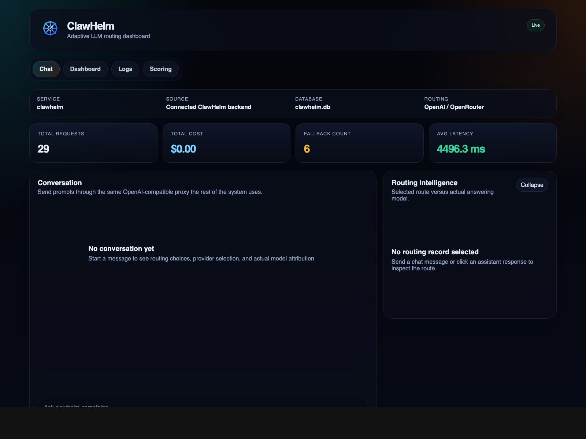
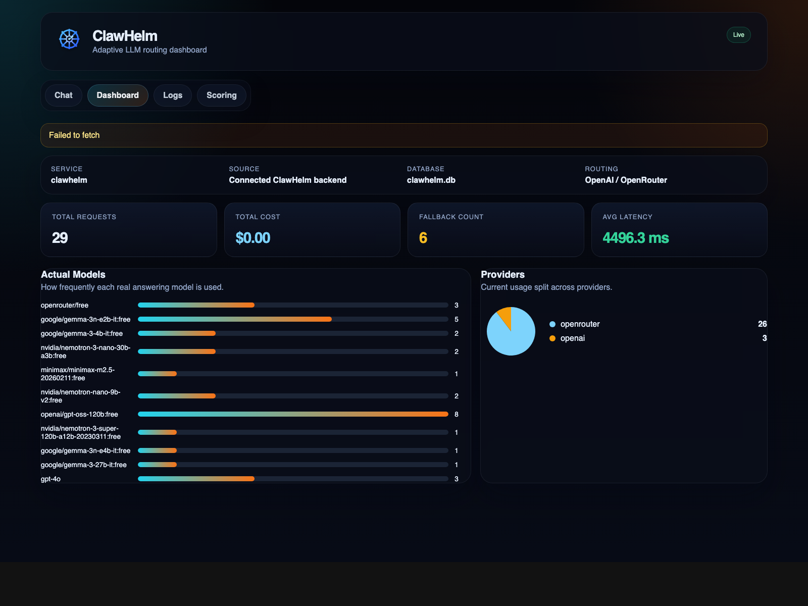
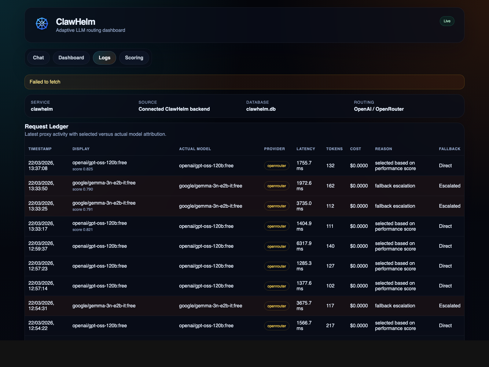
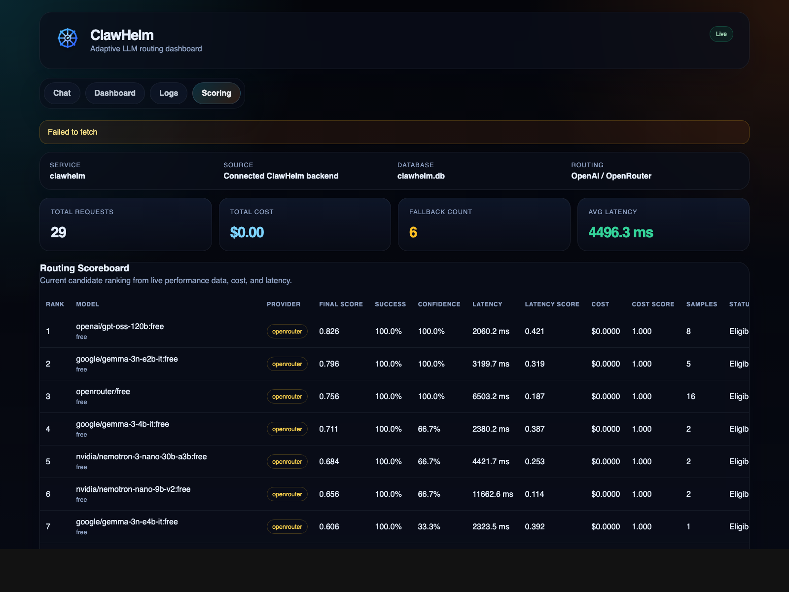

# clawhelm


[](LICENSE)
[](https://github.com/YugantM/clawhelm/actions/workflows/deploy-pages.yml)
[](https://yugantm.github.io/clawhelm/)

[GitHub Repository](https://github.com/YugantM/clawhelm) · [Live Demo](https://yugantm.github.io/clawhelm/) · [Pages Workflow Run](https://github.com/YugantM/clawhelm/actions/runs/23403839069)

Clawhelm is an OpenAI-compatible proxy and routing control layer for OpenClaw. It accepts normal OpenAI chat completion requests, selects a provider and model, forwards the request, returns the upstream response transparently, and records enough routing intelligence to explain why a request was sent where it was sent.

It currently combines:

- a FastAPI proxy
- adaptive provider/model routing
- OpenRouter and OpenAI support
- SQLite request logging
- a React dashboard for chat, logs, metrics, and scoring visibility

## Brand Assets

The frontend now includes a small logo set based on the provided mark:

- dark UI wordmark: [frontend/public/clawhelm-logo-dark.svg](frontend/public/clawhelm-logo-dark.svg)
- print/light background wordmark: [frontend/public/clawhelm-logo-print.svg](frontend/public/clawhelm-logo-print.svg)
- icon/favicon: [frontend/public/clawhelm-icon.svg](frontend/public/clawhelm-icon.svg)

They are used where they add value:

- app header
- favicon
- README branding

I did not add extra redundant variants beyond dark, print, and icon.

## Product Views

### Chat



### Dashboard



### Logs



### Scoring



## What Clawhelm Solves

OpenClaw can point at an OpenAI-compatible `base_url`, but that only gives you transport compatibility. It does not give you routing, provider abstraction, cost visibility, actual model attribution, or fallback transparency.

Clawhelm adds that missing control layer.

At a high level:

1. OpenClaw sends `POST /v1/chat/completions`
2. Clawhelm decides which provider/model should handle the request
3. Clawhelm forwards the request with the correct provider key
4. Clawhelm returns the provider response in OpenAI-compatible shape
5. Clawhelm logs the route, actual answering model, latency, cost, and fallback behavior
6. The frontend dashboard exposes that data in real time

## Core Capabilities

### 1. OpenAI-Compatible Proxy

External interface:

- `POST /v1/chat/completions`

The proxy is designed to be invisible to OpenClaw:

- request body shape remains OpenAI-compatible
- response shape remains OpenAI-compatible
- client integrations do not need custom proxy-specific handling

### 2. Provider-Aware Routing

Clawhelm can route between:

- OpenAI
- OpenRouter

The router does not just choose a model string. It chooses a provider-aware route:

- provider
- model
- base URL
- API key
- routing reason
- score

### 3. Actual Model Attribution

This matters especially for OpenRouter.

The router may select a route like `openrouter/free`, but the actual model that answered may be something else. Clawhelm records both:

- `selected_model`
- `actual_model`

This means the dashboard can show:

- what the router intended
- what model actually answered

### 4. Adaptive Scoring

Clawhelm no longer relies only on static prompt-length routing. It builds a candidate pool of usable models and scores them using observed performance.

The current routing score is based on:

- success rate
- average latency
- average cost
- sample confidence

The score is bounded and deterministic. Free models are favorable, but not infinitely favorable. That prevents a very slow free model from dominating purely because cost is zero.

### 5. Dynamic Fallback

Fallback is no longer a fixed hardcoded chain.

If the top-ranked candidate fails:

- the proxy tries the next ranked candidate
- then the next one after that
- until candidates are exhausted

That means fallback behavior follows the current ranked pool instead of a stale manual escalation chain.

### 6. Request Intelligence UI

The dashboard exposes four views:

- `Chat`
  - send prompts through the same proxy endpoint
  - inspect route selection on individual responses
- `Dashboard`
  - aggregate request and provider metrics
  - model and provider usage charts
- `Logs`
  - full request ledger
  - selected score next to the chosen model
- `Scoring`
  - full ranked candidate table with score components

## Architecture

```text
OpenClaw / UI
      |
      v
POST /v1/chat/completions
      |
      v
clawhelm proxy
  - parse request
  - build usable model pool
  - score candidates
  - choose best route
  - forward to provider
  - retry next-ranked candidate on failure
      |
      +--> OpenAI
      |
      +--> OpenRouter
      |
      v
SQLite logs + /logs + /stats
      |
      v
React dashboard
```

## Backend Modules

### [app/main.py](app/main.py)

FastAPI app entrypoint.

Responsibilities:

- app startup and lifespan
- database initialization
- HTTP client lifecycle
- route registration
- CORS

### [app/proxy.py](app/proxy.py)

Proxy forwarding layer.

Responsibilities:

- accept OpenAI-compatible request bodies
- override the model before forwarding
- forward to the selected provider
- preserve upstream response shape
- log request metadata
- handle dynamic fallback

### [app/models_registry.py](app/models_registry.py)

Provider/model inventory.

Responsibilities:

- load static configured models
- include only usable providers based on keys and allow flags
- include `openrouter/free`
- include discovered free models
- include previously successful actual models from logs

### [app/performance.py](app/performance.py)

Routing-performance aggregation.

Responsibilities:

- compute `success_rate`
- compute `avg_latency`
- compute `avg_cost`
- compute bounded score components
- apply sample-confidence damping

### [app/router.py](app/router.py)

Adaptive route selection.

Responsibilities:

- build ranked candidate list
- exclude underperforming models
- expose candidate score snapshots
- return provider-aware route decisions

### [app/db.py](app/db.py)

SQLite logging and stats aggregation.

Responsibilities:

- initialize schema
- safe migrations
- insert request logs
- compute `/logs`
- compute `/stats`

### [app/costs.py](app/costs.py)

Cost estimation helpers.

### [app/mock_provider.py](app/mock_provider.py)

Local mock upstream used for smoke tests and automated backend tests.

## Frontend Modules

### [frontend/src/App.jsx](frontend/src/App.jsx)

Top-level app shell.

Responsibilities:

- polling `/logs` and `/stats`
- chat submission flow
- tab state
- global metrics bar
- error/warning banners

### [frontend/src/components/LogsTable.jsx](frontend/src/components/LogsTable.jsx)

Request ledger view.

Shows:

- selected display model
- actual model
- provider
- latency
- tokens
- estimated cost
- routing reason
- fallback state
- routing score

### [frontend/src/components/ScoringTable.jsx](frontend/src/components/ScoringTable.jsx)

Current ranked candidate table.

Shows:

- rank
- model
- provider
- final score
- success rate
- confidence
- average latency
- latency score
- average cost
- cost score
- sample count
- eligibility state

## Project Structure

```text
clawhelm/
├── app/
│   ├── costs.py
│   ├── db.py
│   ├── main.py
│   ├── mock_provider.py
│   ├── models.py
│   ├── models_registry.py
│   ├── performance.py
│   ├── proxy.py
│   └── router.py
├── docs/
│   ├── clawhelm-frontend.png
│   └── screens/
│       ├── chat.png
│       ├── dashboard.png
│       ├── logs.png
│       └── scoring.png
├── frontend/
│   ├── src/
│   │   ├── components/
│   │   ├── pages/
│   │   ├── App.jsx
│   │   ├── api.js
│   │   ├── main.jsx
│   │   └── styles.css
│   ├── package.json
│   └── vite.config.js
├── scripts/
│   ├── run_dashboard.sh
│   └── smoke_test.sh
├── tests/
│   └── test_proxy.py
├── requirements.txt
└── README.md
```

## Environment Configuration

Example `.env`:

```env
PROVIDER_BASE_URL=https://api.openai.com
PROVIDER_API_KEY=
ALLOW_OPENAI_ROUTING=false

OPENROUTER_BASE_URL=https://openrouter.ai/api/v1
OPENROUTER_API_KEY=your_openrouter_key
ALLOW_OPENROUTER_ROUTING=true
ENABLE_OPENROUTER=true

CHEAP_MODEL=gpt-3.5-turbo
MID_MODEL=gpt-4o-mini
EXPENSIVE_MODEL=gpt-4o

CHEAP_MODEL_COST_PER_1K_TOKENS=0.5
MID_MODEL_COST_PER_1K_TOKENS=1.0
EXPENSIVE_MODEL_COST_PER_1K_TOKENS=5.0
DEFAULT_MODEL_COST_PER_1K_TOKENS=1.0

OPENCLAW_MODELS=meta-llama/llama-3.3-8b-instruct:free,google/gemma-2-9b-it:free
FRONTEND_ORIGINS=http://localhost:5173,http://127.0.0.1:5173
```

## Install

### Backend

```bash
python3 -m venv .venv
source .venv/bin/activate
.venv/bin/pip install -r requirements.txt
```

### Frontend

```bash
cd frontend
npm install
```

## Open Source Project Files

This repository includes the standard community health files for public
collaboration:

- [LICENSE](LICENSE)
- [CONTRIBUTING.md](CONTRIBUTING.md)
- [CODE_OF_CONDUCT.md](CODE_OF_CONDUCT.md)
- [SECURITY.md](SECURITY.md)
- [.github/ISSUE_TEMPLATE](.github/ISSUE_TEMPLATE)
- [.github/pull_request_template.md](.github/pull_request_template.md)

## Frontend UX Notes

- `Enter` sends a chat message
- `Shift+Enter` inserts a newline
- the routing intelligence side panel can be collapsed from the chat view
- the runtime strip shows which data source the dashboard is attached to and which SQLite file is serving the local UI
- tab state is URL-addressable with:
  - `#Chat`
  - `#Dashboard`
  - `#Logs`
  - `#Scoring`

## Run

### Recommended

From the repo root:

```bash
./scripts/run_dashboard.sh
```

This starts:

- FastAPI on `127.0.0.1:8000`
- Vite on `127.0.0.1:5173`

### Manual

Backend:

```bash
source .venv/bin/activate
uvicorn app.main:app --host 127.0.0.1 --port 8000 --reload
```

Frontend:

```bash
cd frontend
npm run dev -- --host 127.0.0.1 --port 5173
```

## OpenClaw Integration

If OpenClaw itself is running on `http://localhost:18789`, that does not mean requests are automatically flowing through ClawHelm.

OpenClaw must be configured to use ClawHelm as its OpenAI-compatible provider base URL.

Use one of these, depending on how OpenClaw expects the base:

```text
http://127.0.0.1:8000
```

or

```text
http://127.0.0.1:8000/v1
```

The important part is that the final request path lands on:

```text
POST http://127.0.0.1:8000/v1/chat/completions
```

If OpenClaw is pointed somewhere else, the ClawHelm dashboard will continue polling `/logs` and `/stats`, but it will never see that OpenClaw traffic.

Quick verification:

1. Start ClawHelm locally with `./scripts/run_dashboard.sh`
2. Open `http://127.0.0.1:5173`
3. Confirm the runtime strip shows the local SQLite file and connected backend state
4. Send a request from OpenClaw
5. Confirm a new row appears in `Logs`

## GitHub Pages

The repo is prepared for GitHub Pages frontend deployment.

Added:

- workflow: [.github/workflows/deploy-pages.yml](.github/workflows/deploy-pages.yml)
- Vite base-path support in [frontend/vite.config.js](frontend/vite.config.js)

How it works:

- on push to `main`, the workflow builds the frontend
- it sets `VITE_BASE_PATH` to `/${repo-name}/`
- it deploys `frontend/dist` to GitHub Pages

After you publish the repo:

1. Push the repository to GitHub.
2. In GitHub, open `Settings -> Pages`.
3. Set the source to `GitHub Actions`.
4. Optional: add a repository variable named `VITE_API_BASE_URL` pointing at your live backend API.
5. Optional: set `VITE_DEMO_MODE=false` if you want the Pages site to use the real backend instead of the static demo experience.

Default behavior:

- the workflow enables a public demo mode by default so the shared Pages link is safe to share
- the public Pages deployment does not expose your private backend logs or live proxy traffic

Public demo usage:

- `Demo` mode uses bundled sample data only
- `Use your own key` enables browser-only `BYOK` mode
- in `BYOK` mode the visitor chooses `OpenRouter` or `OpenAI`, enters their own API key, and sends requests directly from the browser to that provider
- the key is stored only in `sessionStorage`
- logs, stats, and routing insights in `BYOK` mode are local browser-session data, not your real ClawHelm server logs

Important limitation:

- GitHub Pages only hosts the static frontend
- the FastAPI backend still needs to run somewhere else for real shared proxy requests
- `BYOK` on Pages is useful for interactive demos, but it is not the same thing as routing through your self-hosted ClawHelm proxy

## API Endpoints

### `POST /v1/chat/completions`

OpenAI-compatible proxy endpoint.

Example:

```bash
curl http://127.0.0.1:8000/v1/chat/completions \
  -H "Content-Type: application/json" \
  -d '{
    "model": "clawhelm-auto",
    "messages": [
      {"role": "user", "content": "Explain clawhelm in one paragraph."}
    ]
  }'
```

### `GET /logs`

Returns the latest 50 logged requests in reverse chronological order.

Each entry includes:

- selected model
- actual model
- provider
- score
- latency
- token count
- cost
- fallback state

### `GET /stats`

Returns aggregate system intelligence, including:

- `total_requests`
- `successful_requests`
- `failed_requests`
- `fallback_count`
- `avg_latency`
- `total_estimated_cost_usd`
- `requests_by_actual_model`
- `requests_by_provider`
- `performance_by_model`
- `candidate_scores`

### `GET /refresh-models`

Refreshes the provider model inventory.

### `GET /health`

Simple health check.

## Current Routing Logic

### Candidate Pool

The router only considers usable models.

OpenAI models are included only if:

- `PROVIDER_API_KEY` exists
- `ALLOW_OPENAI_ROUTING=true`

OpenRouter models are included only if:

- `OPENROUTER_API_KEY` exists
- `ALLOW_OPENROUTER_ROUTING=true`

The pool may include:

- static configured models
- `openrouter/free`
- fetched OpenRouter free models
- previously successful actual models from logs

### Exclusion Rule

If a model has enough samples and its success rate drops below `0.7`, it is excluded from normal candidate selection.

### Score Inputs

Each model uses:

- `success_rate`
- `avg_latency`
- `avg_cost`
- `confidence`

The current score is intentionally simple and deterministic. It is not ML-based.

### Why The Formula Was Changed

The previous version over-favored zero-cost models because the cost term was effectively unbounded. That meant a free model with very high latency could still dominate.

The current formula fixes that by:

- normalizing latency into a bounded score
- normalizing cost into a bounded score
- dampening the result for low-sample models

That makes the system more willing to move away from a slow model once faster candidates have enough positive evidence.

## Logging Schema

Each request log records:

- `original_model`
- `selected_model`
- `actual_model`
- `model_display_name`
- `provider`
- `is_free_model`
- `model_source`
- `routing_reason`
- `routing_score`
- `status_code`
- `fallback_used`
- `prompt`
- `response`
- `latency`
- `total_tokens`
- `estimated_cost`

## Development Notes

- SQLite schema migrations are safe and additive.
- The proxy strips `content-encoding` when forwarding decompressed upstream responses to avoid browser decoding errors.
- The frontend uses Vite dev proxying, so the browser can call `/logs`, `/stats`, and `/v1/...` through the frontend origin during development.
- The tab state supports URL hashes:
  - `#Chat`
  - `#Dashboard`
  - `#Logs`
  - `#Scoring`

## Testing

Backend:

```bash
make test
```

Smoke test:

```bash
make smoke-test
```

Frontend production build:

```bash
cd frontend
npm run build
```

## Verified Locally

At the time of this README update:

- backend tests were passing
- frontend build was passing
- screenshots were captured from the live local frontend
